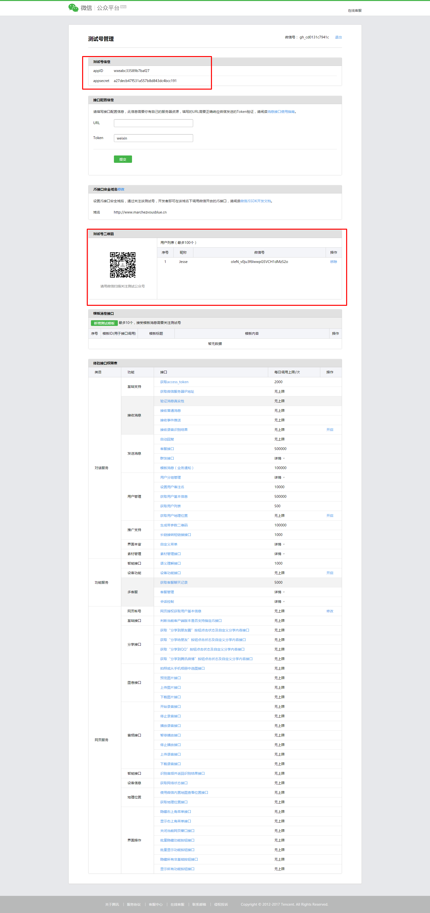
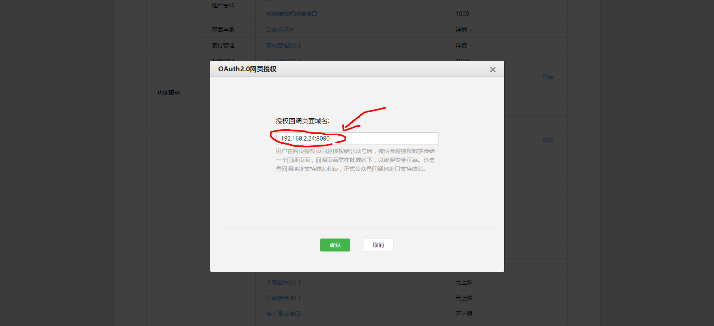

### 第一步获取测试账号并关注


### 第二步填写网页授权域名(注意：应填写域名，如www.google.com(不能添加http://), 测试环境可填写ip地址)



### 第三步拉取code

```javascript
// 获取code
"https://open.weixin.qq.com/connect/oauth2/authorize?appid=wxeabc33589b7baf27&redirect_uri=http://192.168.2.24:8080/index.html&response_type=code&scope=snsapi_base&state=123456#wechat_redirect"
```

### 第三步获取access_token
```javascript
// 获取access_token
"https://api.weixin.qq.com/sns/oauth2/access_token?appid=wxeabc33589b7baf27&secret=a27decb47f531a557b8d843dc4bcc191&code=0213M2GA1A79Yf058fEA1VvQFA13M2G-&grant_type=authorization_code"
```

### 第四步刷新access_token
```javascript
//刷新access_token（如果需要）
"https://api.weixin.qq.com/sns/oauth2/refresh_token?appid=APPID&grant_type=refresh_token&refresh_token=REFRESH_TOKEN"
```

### 第五步刷新access_token
```javascript
//拉取用户信息(需scope为 snsapi_userinfo)
"https://api.weixin.qq.com/sns/userinfo?access_token=ACCESS_TOKEN&openid=OPENID&lang=zh_CN"
```